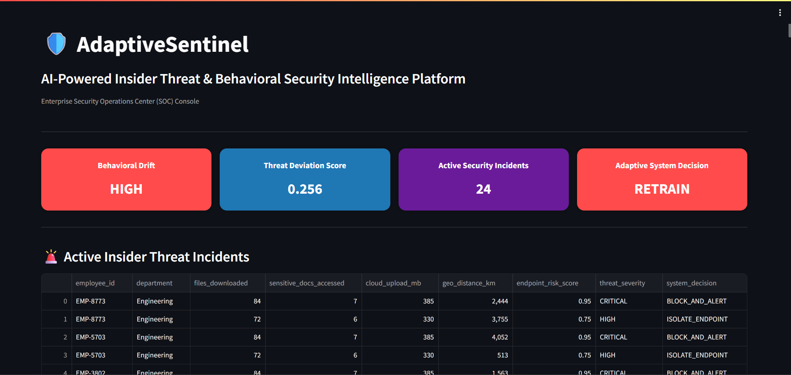
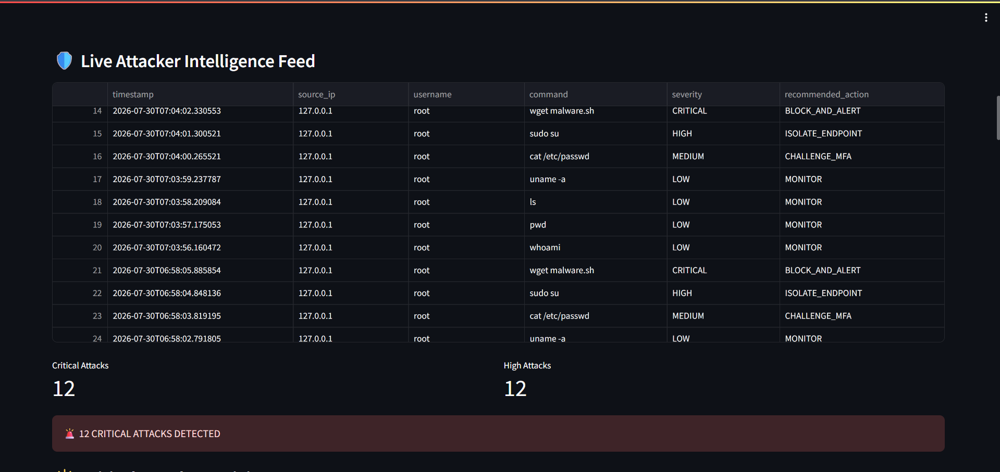
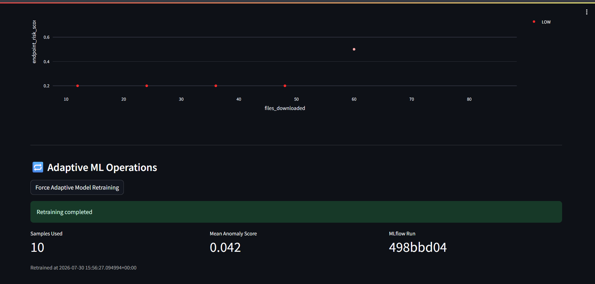
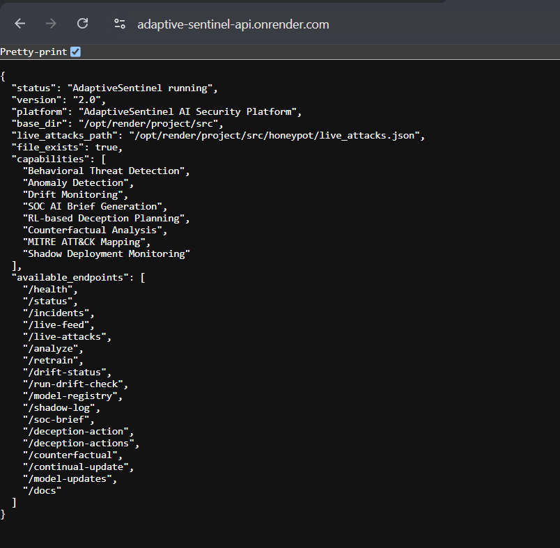
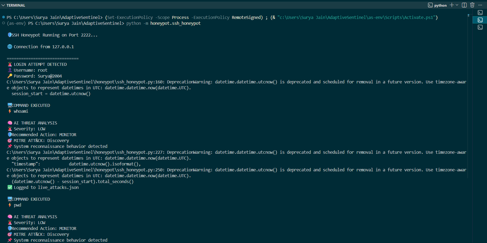
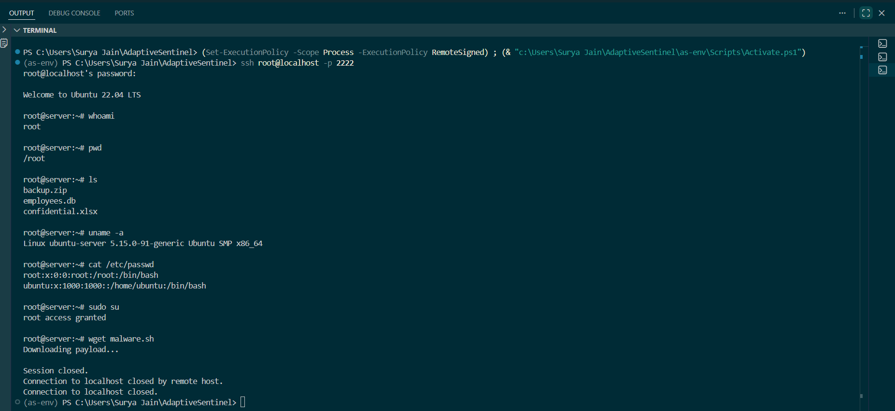
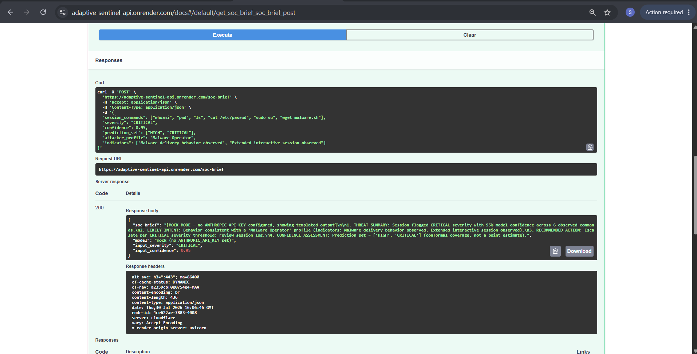
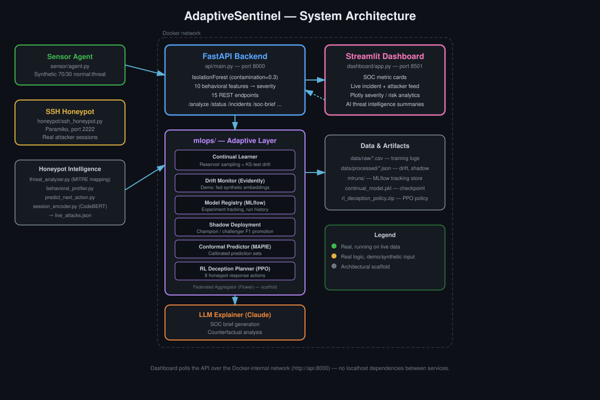

<div align="center">

# 🛡️ AdaptiveSentinel

### AI-Powered Insider Threat & Behavioral Security Intelligence Platform

An end-to-end adaptive SOC (Security Operations Center) system combining unsupervised anomaly detection, continual/online learning, a real SSH honeypot with LLM-driven analysis, and an RL-based deception engine — containerized, deployed, and fully verified in production.

[](https://www.python.org/)
[](https://fastapi.tiangolo.com/)
[](https://www.docker.com/)
[](https://render.com/)
[](#license)

**🔗 [Live API](https://adaptive-sentinel-api.onrender.com) · [Live Dashboard](https://adaptive-sentinel-dashboard.onrender.com) · [API Docs (Swagger)](https://adaptive-sentinel-api.onrender.com/docs) · [Repo](https://github.com/156SURYA/SentinelMind)**

> ⏳ Free-tier hosting: if the links have been idle, the first request may take 30–60 seconds to spin back up. This is expected — not a bug.

</div>

---

## 📖 Overview

AdaptiveSentinel simulates a production-style SOC: it watches employee/endpoint behavior for insider-threat signals, runs a real SSH honeypot to capture live attacker sessions, scores everything through an unsupervised anomaly model, and layers a full MLOps stack on top — continual learning, statistical drift detection, model registry, shadow deployment, conformal prediction, and an RL-based deception planner — with an LLM turning raw model output into analyst-readable briefs.

Every endpoint listed in this README has been **individually tested against the live deployment**, not just described. That distinction matters: this document reflects verified behavior, not aspiration.

---

## 🎥 Screenshots


*SOC dashboard — behavioral drift, threat deviation score, active incidents, and system decision, with the live incident table below*


*Live attacker intelligence feed — real-time command classification with severity and recommended action*


*Force-retrain in action — real samples used, mean anomaly score, and MLflow run ID*


*Full Swagger UI — all 18 live endpoints*


*SSH honeypot server terminal — live threat classification and MITRE ATT&CK mapping mid-session*


*Attacker's-eye view of the same SSH session*


*LLM-generated SOC brief via Swagger, showing the mock-mode fallback response*

**For LinkedIn specifically** (which typically shows only 3-4 project images): use #1, #2, #5, and the architecture diagram below — they tell the strongest visual story in the fewest images (working dashboard, real detected threat, real live attacker session, system design).

---

## 🏗️ Architecture



Three independent surfaces feed the same FastAPI core:
- **Sensor Agent** (`sensor/agent.py`) generates synthetic employee behavior (70% normal / 30% insider-threat) and posts it to `/analyze` — this is also why the model's `contamination` parameter is set to `0.3`, matching the simulator's known injection rate.
- **SSH Honeypot** (`honeypot/ssh_honeypot.py`) is a real Paramiko-based SSH server on port 2222 that captures live attacker sessions, classifies each command against MITRE ATT&CK categories, profiles the attacker, and predicts their next likely action.
- **Streamlit Dashboard** polls the FastAPI backend — confirmed working identically in both local Docker and the live Render deployment.

---

## 🚀 Live Deployment — Fully Verified

Every endpoint below was tested against the production URL on Render, not just locally.

| Endpoint | Method | Verified Result |
|---|---|---|
| `/` | GET | Platform info, capabilities, endpoint list |
| `/health` | GET | `{"status": "healthy", "record_count": 84, ...}` |
| `/status` | GET | Real drift level, threat score, incident count |
| `/incidents` | GET | HIGH/CRITICAL filtered events |
| `/live-feed` / `/live-attacks` | GET | Full attack log |
| `/analyze` | POST | Real severity + anomaly score (e.g. MEDIUM / -0.0125) |
| `/retrain` | POST | Real MLflow run logged (e.g. run ID c9c661d0...) |
| `/continual-update` | POST | Online learner update |
| `/model-updates` | GET | Continual learner update history |
| `/drift-status` | GET | Last recorded drift alert |
| `/run-drift-check` | POST | Evidently-based drift report (honest "no_baseline" on fresh deploy) |
| `/model-registry` | GET | Real MLflow-logged runs |
| `/shadow-log` | GET | Champion/challenger comparison log |
| `/soc-brief` | POST | LLM-generated analyst brief (mock-mode fallback verified live) |
| `/counterfactual` | POST | LLM-generated evasion analysis |
| `/deception-actions` | GET | List of 8 RL deception strategies |
| `/deception-action` | POST | Real PPO inference, verified: action_id 6, "expose_decoy_database" |
| `/docs` | GET | Interactive Swagger UI |

Both `/analyze` and `/continual-update` return a clean `422` with a helpful message for invalid input (e.g. an unrecognized department) rather than a raw stack trace — validated explicitly during testing.

---

## 🧠 Key Features

| Feature | Status |
|---|---|
| Unsupervised anomaly detection | ✅ Live — IsolationForest over 10 behavioral features |
| Continual / online learning | ✅ Live — reservoir sampling + KS-test drift detection, incremental retraining |
| Statistical drift monitoring | ✅ Live (internal, real KS-test) / ⚠️ `/run-drift-check`'s Evidently report currently runs on synthetic embeddings, not live session data |
| MLflow experiment tracking | ✅ Live — every retrain and update logged with a real run ID |
| Shadow deployment | ✅ Live pattern — champion/challenger with F1-based promotion |
| Conformal prediction | ✅ Live — MAPIE-based calibrated prediction sets |
| LLM-generated SOC briefs | ✅ Live, currently in mock mode (no ANTHROPIC_API_KEY configured on the hosted deployment — gracefully degrades to a templated response instead of failing) |
| RL-based deception planning | ✅ Live, verified inference — trained via PPO over a 270-dim state space; reward function is currently a simulated proxy, not live honeypot telemetry |
| Real SSH honeypot | ✅ Live — genuine Paramiko server capturing real sessions, not simulated |
| Real-time SOC dashboard | ✅ Live — 4 metric cards, live incident/attacker feeds, Plotly analytics |
| Fully Dockerized | ✅ Live — multi-service Compose orchestration |
| Deployed to production | ✅ Live on Render — every endpoint independently tested |

---

## 📁 Project Structure

```
AdaptiveSentinel/
│
├── api/
│   └── main.py                  # FastAPI backend, 18 endpoints, lazy-loaded heavy deps
│
├── dashboard/
│   ├── app.py                   # Streamlit SOC console
│   └── Dockerfile
│
├── mlops/                       # Adaptive ML layer
│   ├── continual_learner.py     # Reservoir sampling + KS-test drift + incremental retrain
│   ├── drift_monitor.py         # Evidently-based drift reporting
│   ├── model_registry.py        # MLflow experiment tracking
│   ├── shadow_deployment.py     # Champion/challenger promotion
│   ├── conformal_predictor.py   # MAPIE calibrated prediction sets
│   ├── rl_deception_planner.py  # PPO-based deception policy (gymnasium + stable-baselines3)
│   ├── llm_explainer.py         # Claude-based SOC briefs, with mock-mode fallback
│   ├── federated_aggregator.py  # Flower FedAvg aggregation scaffold
│   └── benchmark.py             # Batch vs continual learner evaluation harness
│
├── honeypot/                    # Real SSH honeypot + attacker intelligence
│   ├── ssh_honeypot.py          # Paramiko SSH server, port 2222
│   ├── threat_analyzer.py       # Command classification + MITRE mapping
│   ├── behavioral_profiler.py   # Attacker archetype classification
│   ├── predict_next_action.py   # Next-action prediction
│   ├── session_encoder.py       # CodeBERT session embeddings (+ Redis store)
│   └── app.py                   # Lightweight login-anomaly FastAPI service
│
├── models/                      # Secondary anomaly model for login/credential behavior
│   └── anomaly_detector.py
│
├── sensor/
│   └── agent.py                 # Synthetic employee behavior generator (70/30 normal/threat)
│
├── data/raw/                    # Training seed data (tracked in git, required for deploy)
├── mlruns/                      # MLflow tracking store
├── media/                       # Screenshots + architecture diagram
│
├── Dockerfile
├── docker-compose.yml
├── render.yaml
├── requirements.txt
└── README.md
```

---

## 🚀 Getting Started (Local)

```bash
git clone https://github.com/156SURYA/SentinelMind.git
cd SentinelMind
docker-compose up --build
```

| Component | URL |
|---|---|
| SOC Dashboard | http://localhost:8501 |
| API Health | http://localhost:8000/health |
| API Docs | http://localhost:8000/docs |

Run the honeypot and sensor separately (not containerized yet):
```bash
python -m honeypot.ssh_honeypot     # SSH server on port 2222
python -m sensor.agent              # Synthetic telemetry every 5s
```

---

## ⚙️ Configuration

To enable real LLM-generated SOC briefs (instead of the mock-mode fallback currently active on the hosted deployment), set:
```bash
export ANTHROPIC_API_KEY=your_key_here
```
Without it, `/soc-brief` and `/counterfactual` automatically fall back to templated responses rather than failing — a deliberate graceful-degradation design, not an oversight.

---

## 🧪 Model Evaluation — Real Results

`mlops/benchmark.py` compares the batch IsolationForest baseline against the continual online learner on synthetic streams with injected concept drift (5 runs):

| Metric | Batch (mean ± std) | Continual (mean ± std) | Delta |
|---|---|---|---|
| F1 | 0.8734 ± 0.0562 | 0.8807 ± 0.0475 | +0.0073 |
| Precision | 0.7798 ± 0.0935 | 0.7902 ± 0.0786 | +0.0104 |
| Recall | 1.0000 ± 0.0000 | 1.0000 ± 0.0000 | +0.0000 |
| Accuracy | 0.9364 ± 0.0291 | 0.9369 ± 0.0283 | +0.0005 |
| AUC-ROC | 0.9999 ± 0.0002 | 0.9998 ± 0.0003 | -0.0001 |

The continual learner shows a small, consistent F1 improvement under simulated drift — modest, not dramatic, and reported honestly rather than oversold.

---

## 📊 Project Status — What's Real vs. Scaffolded

| Component | Status |
|---|---|
| IsolationForest anomaly scoring | ✅ Fully live, verified on production |
| Continual learning (reservoir sampling + KS-test drift) | ✅ Fully live, verified |
| MLflow tracking | ✅ Fully live, verified (real run IDs generated) |
| SSH honeypot | ✅ Fully live — real Paramiko server, real sessions |
| Shadow deployment | ✅ Fully live pattern |
| Conformal prediction (MAPIE) | ✅ Fully live |
| LLM SOC brief / counterfactual | ✅ Live, verified in mock mode; real Claude calls require an API key (see Configuration) |
| RL deception planner (PPO) | ✅ Live, verified real inference; reward function is a simulated proxy, not live telemetry |
| Evidently drift report (`/run-drift-check`) | ✅ Live, verified; currently runs on synthetic embeddings, not real session data |
| Model promotion (`promote_model`) | ⚠️ Stub, logs intent only |
| Federated learning (Flower) | ⚠️ Aggregation logic real; per-node local training loop is a placeholder |
| Session embeddings (CodeBERT) to RL planner | ⚠️ Both exist independently but aren't wired together (768-dim vs 256-dim mismatch) |
| SHAP values in SOC brief | ⚠️ Currently example values, not computed live from the model |

---

## 🗺️ Known Limitations & Roadmap

- Retraining currently re-fits on the same static seed CSV. No feedback loop yet feeds newly-analyzed events back into training data, so successive retrains converge to nearly the same model.
- The honeypot's attacker session is a fixed scripted sequence. Repeated runs produce identical severity distributions, which is fine for demoing the pipeline but doesn't reflect varied attacker behavior.
- Two independent anomaly models exist: the main insider-threat model (`api/main.py`) and a separate login/credential-behavior model (`models/anomaly_detector.py`, used only by `honeypot/app.py`). Intentional separation, not duplication, but worth being precise about if asked.
- Honeypot and sensor run outside Docker in this setup. Containerizing them as additional Compose services is a natural next step.
- `contamination=0.3` reflects the synthetic sensor's known 30% injection rate, not a real-world insider-threat base rate.

---

## 📌 Tech Stack

**Core:** Python 3.10, FastAPI, Streamlit, Docker & Docker Compose, Render
**ML:** scikit-learn (IsolationForest), scipy (KS-test), PyTorch (CPU), HuggingFace Transformers (CodeBERT)
**MLOps:** MLflow, Evidently, MAPIE (conformal prediction)
**RL / Federated:** Gymnasium, Stable-Baselines3 (PPO), Flower
**LLM:** Anthropic Claude API
**Honeypot:** Paramiko (SSH), Redis
**Visualization:** Plotly

---

## 📜 License

This project is for educational and portfolio purposes.

---

<div align="center">

Built by **Surya Jain** · [LinkedIn](https://www.linkedin.com/in/surya-jain/) · [GitHub](https://github.com/156SURYA)

</div>